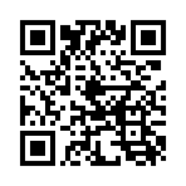
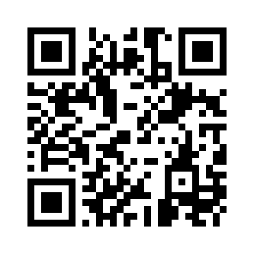

# Support This Project

Thank you for considering supporting my work! You can contribute through the following methods:

## Traditional Payment

> **PayPal**

- [paypal.me/bedlam520](https://paypal.me/bedlam520)

---

## Cryptocurrency

> **Ethereum / EVM Networks**

---


---

> **Supported Tokens**: Send ETH, USDC, or any ERC-20 tokens to:

---

```ethereum:
0xdece49eF08A75f02499d965a36eEAEfFCdD3D483
```

---

> **Supported Networks**: Ethereum, Polygon, Arbitrum, Optimism, Base, BSC, and other EVM-compatible chains.

---

> **Solana / SVM Networks**

---


---

> **Supported Tokens**: Send SOL, USDC, or any SPL, or Token 2022 tokens to:

---

```solana:
3aLmd45HzUk5bZfCR1uKsawyVNGjarSKCkEnvjETaAPk
```

---

> **Supported Networks**: Solana, Eclipse, Sonic SVM.

---

**Note:** Always verify addresses before sending. Cryptocurrency transactions are irreversible.

---

> **Farcaster**

---



---

[Farcaster](https://farcaster.xyz/bedlam520.eth)

> **BaseApp**

---



---

[BaseApp](https://base.app/profile/bedlam520.eth)

---
